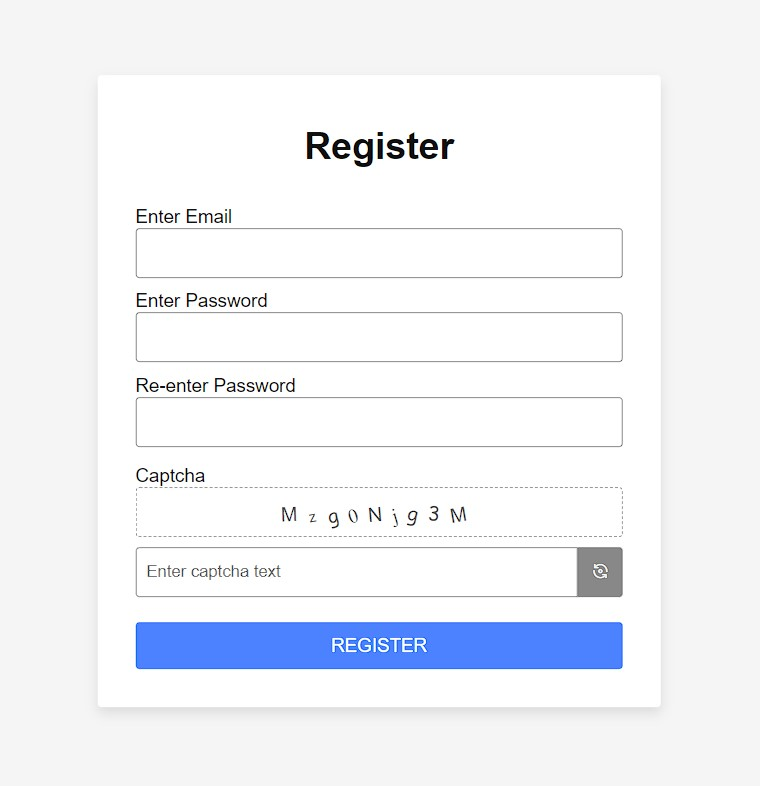
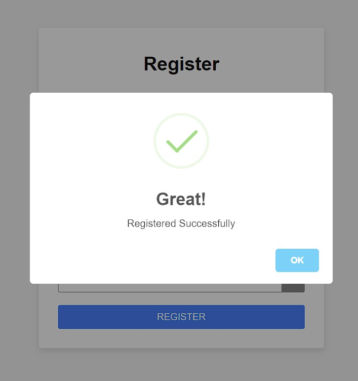
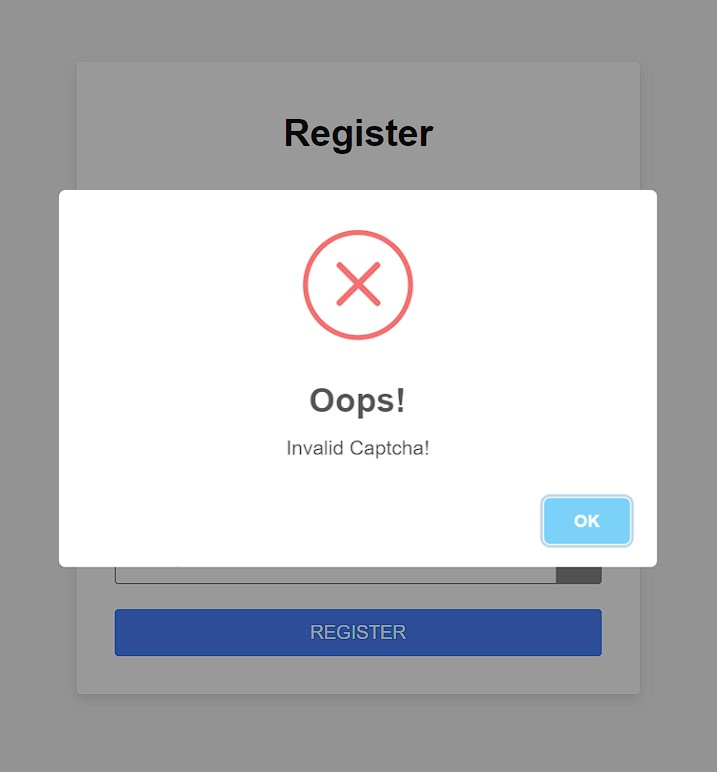

## Captcha-Form

Simple Register Form with client side captcha validation using JavaScript.

## Project Specifications

- Create form UI
- When the page loads/refreshes,Captcha gets generated as random letters and numbers in un-oriented fashion.
- Following this captcha is a reload button that outputs a new code every time the user clicks on it.
- The user has to enter the code produced in the image into the provided text box.
- After entering the code into the input box, the user has to click on the register button. When the user clicks on register, a validation takes place. If the user enters the captcha code correctly, the user sees a success alert. In case the user enters a wrong code, the user sees an error alert.

## Demo

